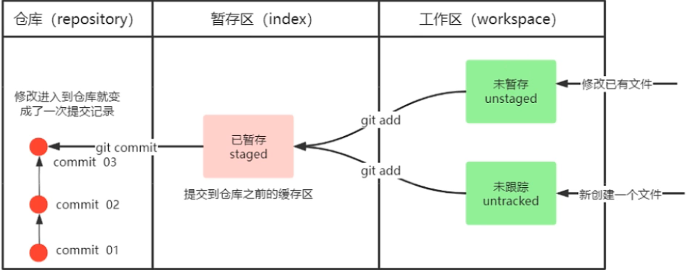

# Git指令整理 —— Xianx

## I、配置git
### 1、git bash中配置用户标识(必要)
- `$ git config --global user.name "Xianx"`
- `$ git config --global user.email "545756792@qq.com"`

&emsp;

## git命令框中的操作
### 01、复制命令行中的内容只需要鼠标选择需要的内容即可复制，按鼠标滚轮即可粘贴
### 02、`git log`看提交日志中，需要退出日志则输入Q即可
### 03、`touch filename` 利用touch可直接创建文件
### 04、`rm filename` 可直接删除文件
### 05、`vi fliename` 可直接编辑文件，进入编辑模式后按键盘的i或者insert即可切换到输入模式输入，要退出的话按ESC，输入:wq退出并保存，:w仅保存不退出
### 06、日志格式成一行清晰且美观显示
- `git log --pretty=oneline --abbrev-commit --all --graph`

### 07、git较长的组合指令可使用`alias`取别名,比如06的指令，可取成git-log
- `alias git-log='git log --pretty=oneline --abbrev-commit --all --graph'
`

&emsp;

## II、git本地仓库操作

### 1、查看仓库状态(暂存区、工作区的文件状态)
- `git status` 

### 2、查看提交日志
- `git log` 查看提交日志(每次提交都会显示用户提交日志信息)，

### 3、添加工作区文件到暂存区
- `git add .` 添加文件进暂存区，当修改了文件或者新增文件时都需要add进入暂存区，git status会提示未commit

### 4、添加暂存区文件到本地仓库
- `git commit -m 'desc'` 提交文件到仓库

### 5、版本回退
- `git reset --hard commitID` 版本回退，commitID可以使用`git log`指令查看。

- `git reflog` 所有操作记录，当版本回退后我们又想要回去之前的版本，而由于回退之后log日志里就没有了之前的commitID时，则用git reflog查看上次的操作记录，即可找到commitID

### 6、添加文件至忽略列表
- 有一些文件是无需纳入git的管理的，也不希望它们老是出现在未跟踪的文件列表里，比如自动生成的文件、日志文件、临时文件啥的，这时候就需要创建一个`.gitignore`的文件，列出要忽略的文件格式即可(图1 忽略*.a的文件)。

### 7、分支
- 分支与分支直接的文件是互不干扰的，比如我在master分支下创建了hello.txt文件，那么当切换到dev分支下，由于hello.txt是在master分支下创建不属于dev的，所以切换到dev分支时本地是没有hello.txt文件的。
- 分支可以把一些工作从项目主线分离开来，比如重大bug修改，开发新功能，以免影响开发主线。

#### 01、分支常用指令
- `git log` 日志中(HEAD->)指示着当前所在的分支，每个操作日志commit ID后面都带说明，标识该操作是由哪个分支完成的

- `git branch` 查看分支列表

- `git branch 分支名` 创建本地分支

- `git checkout 分支名` 切换分支

- `git checkout -b 分支名` 创建并直接切换分支

- `git merge 分支名` 合并分支

- `git branch -d 分支名` 删除分支

- `git branch -D -d 分支名` 不做检查直接删除
#### 02、解决分支冲突
- 当两个分支对同个文件进行修改时可能会存在冲突，例如同时修改了同个文件的同一行，这时候进行merge合并分支时，git不知道要选择哪个分支所写的内容进保存，这时候就需要我们手动去解决，有冲突时合并完成后控制台会报如图1的提示信息，显示自动合并失败，并且冲突的那个文件内容会如图1所呈现的样子，分为两部分，需要我们手动去删除掉不需要保留的内容(<<< === HEAD dev)，之后再add、commit即可解决合并冲突(无需再次merge)。
- 1、解决文件中的冲突地方
- 2、将解决完冲突的文件加入暂存区（add）
- 3、提交到仓库（commit）

#### 03、开发中分支的使用与流程

- `master` (生产) 分支：实际运行在生产环境的，也是发布版本
- `develop` (开发) 分支：该分支开发完毕后，需要合并到master分支，准备上线
- `feature/xxxx` (新版本、新特性开发)分支，从develop创建的分支，一般和develop同时开发，开完完毕后合并到develop分支
- `hotfix/xxxx` (线上bug修复) 分支，从master创建的分支，修复线上bug，修复完毕后合并到master、develop分支。

&emsp;

## III、git远程仓库
### 1、本地生成SSH密钥
- `ssh-keygen -t rsa` 一路回车即可生成
- `cat ~/.ssh/id_rsa.pub` 密钥存储在文件中，通过该指令可以拿到密钥

### 2、github上配置SSH密钥
将本地生成的ssh密钥粘贴到github上进行配置关联

### 3、本地连接github测试
`ssh -T git@github.com` ssh连接github，首次连接一路回车即可生成，输入yes完毕

### 4、解除ssl验证
`git config --global http.sslVerify "false"` 服务器的SSL证书没有经过第三方机构的签署，需要解除ssl验证后才可push代码否则会抛 `errno 10054` 错误

### 5、添加远程仓库
`git remote origin 仓库SSH地址` 配置远程仓库地址

### 6、查看配置的所有远程仓库
`git remote`

### 7、推送本地仓库至远程仓库
`git push origin master ` 可能会出现奇奇怪怪的错误，和其他多余的步骤如8

### 8、(非必要，可能出现)建立github连接
push后弹出连接框，选择sign in with a code，点击网址跳转到网站进行认证，认证完毕后再次push即可

### 9、远程仓库克隆
`git clone 仓库SSH地址` 克隆整个仓库内容到本地，同一个仓库一般只使用一次，默认克隆默认分支

`git clone --branch LearnVux git@github.com:x545756792/LearnVue.git` 克隆单个分支

### 10、删除远程仓库分支
`git push origin --delete dev`

### 11、抓取与拉取
克隆仓库之后，有可能仓库的文件内容会有变化，当我们需要获取到更新的内容文件时，这时候再重新`clone`显然是没有必要的，这时候就要用到抓取和拉取，使用这两个操作可以直接获取到更新的所有文件。
- `git fetch [remote name] [branch name]` ，也可`git fetch` 如果不指定远端名称和分支名则抓取所有分支。fetch会抓取到仓库里更新的所有文件到本地，不会进行合并(相当于拉到了本地但没有融入到本地项目中)，需要再`git merge origin` 将本地仓库和远程仓库进行一个合并，此时远程仓库的更新文件就和本地仓库的项目融合到了一起。

- `git pull [remote name] [branch name]` ，也可`git pull` 如果不指定远端名称和分支名则抓取所有分支并自动合并，pull和fetch作用类似，只是pull更加方便，拉取后直接合并，无需再`merge`操作

### 12、解决远程冲突
- 远程合并冲突和本地合并冲突的解决方式是一样的，pull拉取到本地合并触发错误，找到错误文件打开，删除不需要的内容，留下需要的内容后再commit即可。
- git-log查看日志，如果HEAD在最顶端的操作项中则标识当前本地仓库的内容是跟远程仓库一样最新的。
